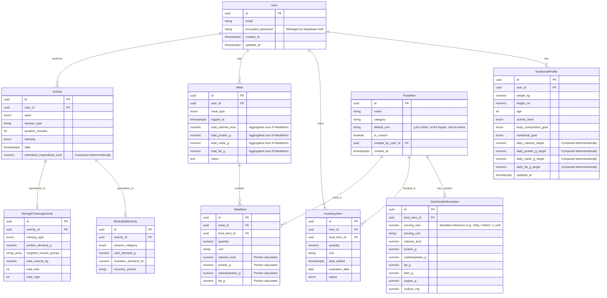

# Data Model and Entity-Relationship Diagram

## 1. Overview and Scope

### Purpose

This document defines the complete initial data model of the application and its entity relationships for the Intelligent Sports Nutrition System MVP.

The domain covers all core entities required by the MVP to connect physical activity, nutrition targets, food intake, and available inventory, including:

- **Users**: Core user accounts and authentication.
- **Nutritional profiles**: User physical attributes, goals, and daily macro/calorie targets.
- **Food items (`FoodItem`)**: General food dictionary catalog.
- **Nutritional information**: Detailed macro and micro content per food item (`FoodItem`).
- **Inventory items**: Pantry stock owned by users, tracking quantities and expiry.
- **Meals**: Logged eating events (e.g., Lunch, Post-workout meal).
- **Meal items**: Individual food items and portion sizes consumed within a meal.
- **Activities**: General physical exercise sessions (core model).
- **Basketball activities**: Specialized activity data for basketball sessions (training vs. match).
- **Strength training activities**: Specialized activity data for gym sessions (hypertrophy vs. strength vs. endurance).

The model is explicitly designed following Domain-Driven Design (DDD) principles so that the core domain remains decoupled from specific sports, allowing future sports (e.g., running, cycling, football, swimming) to be added as modular extensions without modifying the application core.

### Storage

PostgreSQL (v15+) is used as the primary relational database.

Supabase provides the managed PostgreSQL instance, real-time sync, and built-in authentication framework (`auth.users`).

Primary keys use PostgreSQL's native `gen_random_uuid()` function (built into PostgreSQL 13+ and Supabase), eliminating external extension dependencies.

---

## 2. Goals

- Define all core domain entities and sport specializations required by the MVP.
- Specify attributes, PostgreSQL data types, nullability, and primary/foreign keys.
- Define explicit relationships and cardinality (1:1, 1:N, N:M).
- Establish domain constraints, check constraints, enums, and business invariants.
- Ensure strict separation between deterministic calculated data and AI-generated content.
- Provide a clear indexing strategy to optimize daily queries (inventory, meals, activity tracking).
- Produce a clear, maintainable Entity-Relationship Diagram (ERD) using Mermaid syntax.

---

## 3. Entity-Relationship Diagram (ERD)



---

## 4. Detailed Entity Dictionary

### 4.1. `User` (Supabase Auth & Domain User)

In Supabase, user authentication credentials and security metadata are managed directly within the `auth.users` schema. The domain model maps to this entity via foreign keys.

| Column | Type | Constraints | Notes |
|---|---|---|---|
| `id` | `uuid` | PK, NOT NULL, DEFAULT `gen_random_uuid()` | Primary Key (references `auth.users.id`) |
| `email` | `varchar(255)` | NOT NULL, UNIQUE | User login email address |
| `encrypted_password` | `varchar(255)` | NOT NULL | Managed automatically by Supabase Auth (`auth.users`) |
| `created_at` | `timestamptz` | NOT NULL, DEFAULT `now()` | Registration timestamp |
| `updated_at` | `timestamptz` | NOT NULL, DEFAULT `now()` | Profile last updated |

### 4.2. `NutritionalProfile`

All target values (`daily_calories_target`, `daily_protein_g_target`, `daily_carbs_g_target`, `daily_fat_g_target`) are **automatically computed deterministically** by backend calculation formulas (e.g. Mifflin-St Jeor / Katch-McArdle) using the user's weight, height, age, activity level, and goals.

| Column | Type | Constraints | Notes |
|---|---|---|---|
| `id` | `uuid` | PK, NOT NULL, DEFAULT `gen_random_uuid()` | Primary Key |
| `user_id` | `uuid` | FK -> User.id, NOT NULL, UNIQUE | 1:1 relation to User |
| `weight_kg` | `numeric(5,2)` | NOT NULL, CHECK > 0 | Weight in kilograms |
| `height_cm` | `numeric(5,2)` | NOT NULL, CHECK > 0 | Height in centimeters |
| `age` | `integer` | NOT NULL, CHECK > 0 | Age in years |
| `activity_level` | `enum` | NOT NULL | Enum (`SEDENTARY`, `MODERATE`, `ACTIVE`, `VERY_ACTIVE`) |
| `body_composition_goal` | `enum` | NOT NULL | Enum (`MAINTAIN`, `BULK`, `CUT`, `RECOMP`) |
| `nutritional_goal` | `enum` | NOT NULL | Enum (`PERFORMANCE`, `HYPERTROPHY`, `HEALTH`, `FAT_LOSS_FOCUS`) |
| `daily_calories_target` | `numeric(6,2)` | NOT NULL, CHECK >= 0 | Automatically computed daily calorie target (kcal) |
| `daily_protein_g_target` | `numeric(5,2)` | NOT NULL, CHECK >= 0 | Automatically computed daily protein target (g) |
| `daily_carbs_g_target` | `numeric(5,2)` | NOT NULL, CHECK >= 0 | Automatically computed daily carbohydrate target (g) |
| `daily_fat_g_target` | `numeric(5,2)` | NOT NULL, CHECK >= 0 | Automatically computed daily fat target (g) |
| `updated_at` | `timestamptz` | NOT NULL, DEFAULT `now()` | Timestamp of last target recalculation |

### 4.3. `FoodItem`

| Column | Type | Constraints | Notes |
|---|---|---|---|
| `id` | `uuid` | PK, NOT NULL, DEFAULT `gen_random_uuid()` | Primary Key |
| `name` | `varchar(255)` | NOT NULL | Food item name (e.g., Rice, Chicken breast, Olive oil) |
| `category` | `varchar(100)` | NOT NULL | Category (e.g., Meat, Grain, Oils/Fats, Dairy, Fruit) |
| `default_unit` | `varchar(50)` | NOT NULL, DEFAULT 'g' | Base unit (`g` for solids, `ml` for liquids, `unit` for items) |
| `is_custom` | `boolean` | NOT NULL, DEFAULT `false` | True if created by a specific user |
| `created_by_user_id` | `uuid` | FK -> User.id, NULLABLE | Null for global catalog; User ID for user-created foods |
| `created_at` | `timestamptz` | NOT NULL, DEFAULT `now()` | Creation timestamp |

### 4.4. `NutritionalInformation`

| Column | Type | Constraints | Notes |
|---|---|---|---|
| `id` | `uuid` | PK, NOT NULL, DEFAULT `gen_random_uuid()` | Primary Key |
| `food_item_id` | `uuid` | FK -> FoodItem.id, NOT NULL, UNIQUE | 1:1 relation to FoodItem |
| `serving_size` | `numeric(6,2)` | NOT NULL, CHECK > 0 | Reference size (e.g., 100 for 100g/100ml, or 1 for 1 egg) |
| `serving_unit` | `varchar(50)` | NOT NULL, DEFAULT 'g' | Unit of reference amount (`g`, `ml`, `unit`) |
| `calories_kcal` | `numeric(6,2)` | NOT NULL, CHECK >= 0 | Energy per reference serving size |
| `protein_g` | `numeric(5,2)` | NOT NULL, CHECK >= 0 | Protein per reference serving size |
| `carbohydrates_g` | `numeric(5,2)` | NOT NULL, CHECK >= 0 | Carbohydrates per reference serving size |
| `fat_g` | `numeric(5,2)` | NOT NULL, CHECK >= 0 | Fat per reference serving size |
| `fiber_g` | `numeric(5,2)` | NULLABLE, CHECK >= 0 | Optional fiber content |
| `sugars_g` | `numeric(5,2)` | NULLABLE, CHECK >= 0 | Optional sugar content |
| `sodium_mg` | `numeric(6,2)` | NULLABLE, CHECK >= 0 | Optional sodium content |

### 4.5. `InventoryItem`

| Column | Type | Constraints | Notes |
|---|---|---|---|
| `id` | `uuid` | PK, NOT NULL, DEFAULT `gen_random_uuid()` | Primary Key |
| `user_id` | `uuid` | FK -> User.id, NOT NULL | Owner of the inventory item |
| `food_item_id` | `uuid` | FK -> FoodItem.id, NOT NULL | Reference to FoodItem entity |
| `quantity` | `numeric(7,2)` | NOT NULL, CHECK >= 0 | Quantity currently available in pantry |
| `unit` | `varchar(50)` | NOT NULL | Unit of measurement (`g`, `kg`, `ml`, `l`, `unit`) |
| `date_added` | `timestamptz` | NOT NULL, DEFAULT `now()` | Date added to inventory |
| `expiration_date` | `date` | NULLABLE | Product expiration date (if available) |
| `status` | `enum` | NOT NULL, DEFAULT 'AVAILABLE' | Enum (`AVAILABLE`, `LOW_STOCK`, `EXPIRED`, `CONSUMED`) |

### 4.6. `Meal`

| Column | Type | Constraints | Notes |
|---|---|---|---|
| `id` | `uuid` | PK, NOT NULL, DEFAULT `gen_random_uuid()` | Primary Key |
| `user_id` | `uuid` | FK -> User.id, NOT NULL | User who logged the meal |
| `meal_type` | `enum` | NOT NULL | Enum (`BREAKFAST`, `LUNCH`, `DINNER`, `SNACK`, `POST_WORKOUT`) |
| `logged_at` | `timestamptz` | NOT NULL, DEFAULT `now()` | Date and time when meal was consumed |
| `total_calories_kcal` | `numeric(6,2)` | NOT NULL, CHECK >= 0 | Aggregated sum of `MealItem` calories |
| `total_protein_g` | `numeric(5,2)` | NOT NULL, CHECK >= 0 | Aggregated sum of `MealItem` protein |
| `total_carbs_g` | `numeric(5,2)` | NOT NULL, CHECK >= 0 | Aggregated sum of `MealItem` carbs |
| `total_fat_g` | `numeric(5,2)` | NOT NULL, CHECK >= 0 | Aggregated sum of `MealItem` fat |
| `notes` | `text` | NULLABLE | User notes or optional recipe title |

### 4.7. `MealItem`

| Column | Type | Constraints | Notes |
|---|---|---|---|
| `id` | `uuid` | PK, NOT NULL, DEFAULT `gen_random_uuid()` | Primary Key |
| `meal_id` | `uuid` | FK -> Meal.id, NOT NULL | Belongs to Meal |
| `food_item_id` | `uuid` | FK -> FoodItem.id, NOT NULL | Referenced FoodItem entity |
| `quantity` | `numeric(6,2)` | NOT NULL, CHECK > 0 | Amount consumed |
| `unit` | `varchar(50)` | NOT NULL | Unit of measurement (`g`, `ml`, `unit`) |
| `calories_kcal` | `numeric(6,2)` | NOT NULL, CHECK >= 0 | Calculated calories for this item portion |
| `protein_g` | `numeric(5,2)` | NOT NULL, CHECK >= 0 | Calculated protein for this item portion |
| `carbohydrates_g` | `numeric(5,2)` | NOT NULL, CHECK >= 0 | Calculated carbs for this item portion |
| `fat_g` | `numeric(5,2)` | NOT NULL, CHECK >= 0 | Calculated fat for this item portion |


### 4.8. `Activity` (Core Entity)

> `estimated_expenditure_kcal` is **automatically calculated deterministically** by formula based on sport MET value, user weight, duration, and intensity.

| Column | Type | Constraints | Notes |
|---|---|---|---|
| `id` | `uuid` | PK, NOT NULL, DEFAULT `gen_random_uuid()` | Primary Key |
| `user_id` | `uuid` | FK -> User.id, NOT NULL | User who performed the activity |
| `sport` | `enum` | NOT NULL | Enum (`BASKETBALL`, `STRENGTH_TRAINING`) |
| `session_type` | `varchar(100)` | NOT NULL | Session description (e.g., Match, Full Body, Upper Body) |
| `duration_minutes` | `integer` | NOT NULL, CHECK > 0 | Duration in minutes |
| `intensity` | `enum` | NOT NULL | Enum (`LOW`, `MEDIUM`, `HIGH`, `VERY_HIGH`) |
| `date` | `timestamptz` | NOT NULL, DEFAULT `now()` | Timestamp of activity |
| `estimated_expenditure_kcal` | `numeric(6,2)` | NOT NULL, CHECK >= 0 | Automatically computed energy expenditure |

### 4.9. `BasketballActivity` (Specialization Entity)

| Column | Type | Constraints | Notes |
|---|---|---|---|
| `id` | `uuid` | PK, NOT NULL, DEFAULT `gen_random_uuid()` | Primary Key |
| `activity_id` | `uuid` | FK -> Activity.id, NOT NULL, UNIQUE | 1:1 relation to parent Activity |
| `session_category` | `enum` | NOT NULL | Enum (`TRAINING`, `MATCH`) |
| `carb_demand_g` | `numeric(5,2)` | NOT NULL, CHECK >= 0 | Estimated carbohydrate demand (g) for recovery |
| `hydration_demand_ml` | `numeric(6,2)` | NOT NULL, CHECK >= 0 | Recommended fluid intake (ml) |
| `recovery_priority` | `varchar(100)` | NOT NULL | Priority focus (e.g., 'GLYCOGEN_REPLETON_AND_HYDRATION') |

### 4.10. `StrengthTrainingActivity` (Specialization Entity)

| Column | Type | Constraints | Notes |
|---|---|---|---|
| `id` | `uuid` | PK, NOT NULL, DEFAULT `gen_random_uuid()` | Primary Key |
| `activity_id` | `uuid` | FK -> Activity.id, NOT NULL, UNIQUE | 1:1 relation to parent Activity |
| `training_type` | `enum` | NOT NULL | Enum (`HYPERTROPHY`, `STRENGTH`, `POWER`, `HYBRID`, `ENDURANCE`) |
| `protein_demand_g` | `numeric(5,2)` | NOT NULL, CHECK >= 0 | Estimated protein demand (g) for muscle synthesis |
| `targeted_muscle_groups` | `text[]` | NULLABLE | Array of muscle groups (e.g., ['LEGS', 'CHEST']) |
| `total_volume_kg` | `numeric(8,2)` | NULLABLE, CHECK >= 0 | Optional total tonnage moved (kg) |
| `total_sets` | `integer` | NULLABLE, CHECK >= 0 | Optional total completed sets |
| `total_reps` | `integer` | NULLABLE, CHECK >= 0 | Optional total completed reps |

---

## 5. Relationships and Cardinality

- **User → NutritionalProfile**: `1 : 1`
  - CASCADE ON DELETE: Deleting a user deletes their profile.
- **User → InventoryItem**: `1 : N`
  - CASCADE ON DELETE: Deleting a user deletes their inventory items.
- **User → Meal**: `1 : N`
  - CASCADE ON DELETE: Deleting a user deletes their meal logs.
- **Meal → MealItem**: `1 : N`
  - CASCADE ON DELETE: Deleting a meal deletes its constituent meal items.
- **FoodItem → NutritionalInformation**: `1 : 1`
  - CASCADE ON DELETE: Deleting a food item deletes its nutritional values.
- **FoodItem → InventoryItem**: `1 : N`
  - RESTRICT ON DELETE: A food item cannot be deleted if referenced in an active inventory item.
- **FoodItem → MealItem**: `1 : N`
  - RESTRICT ON DELETE: A food item cannot be deleted if referenced in a logged meal item.
- **User → Activity**: `1 : N`
  - CASCADE ON DELETE: Deleting a user deletes their activity sessions.
- **Activity → BasketballActivity**: `1 : 0..1`
  - CASCADE ON DELETE: Specialized record exists only when `Activity.sport = 'BASKETBALL'`.
- **Activity → StrengthTrainingActivity**: `1 : 0..1`
  - CASCADE ON DELETE: Specialized record exists only when `Activity.sport = 'STRENGTH_TRAINING'`.

---

## 6. Constraints, Enums and Invariants

### Enums

```sql
CREATE TYPE activity_sport AS ENUM (
    'BASKETBALL',
    'STRENGTH_TRAINING'
);

CREATE TYPE activity_intensity AS ENUM (
    'LOW',
    'MEDIUM',
    'HIGH',
    'VERY_HIGH'
);

CREATE TYPE basketball_session_category AS ENUM (
    'TRAINING',
    'MATCH'
);

CREATE TYPE strength_training_type AS ENUM (
    'HYPERTROPHY',
    'STRENGTH',
    'POWER',
    'HYBRID',
    'ENDURANCE'
);

CREATE TYPE activity_level AS ENUM (
    'SEDENTARY',
    'MODERATE',
    'ACTIVE',
    'VERY_ACTIVE'
);

CREATE TYPE body_composition_goal AS ENUM (
    'MAINTAIN',      -- Maintenance calories
    'BULK',          -- Caloric surplus
    'CUT',           -- Caloric deficit
    'RECOMP'         -- Maintenance calories with body recomposition focus
);

CREATE TYPE nutritional_goal AS ENUM (
    'PERFORMANCE',   -- High-carbohydrate focus (glycogen demands)
    'HYPERTROPHY',   -- High-protein focus (strength training stimulus)
    'HEALTH',        -- Balanced, standard macronutrient distribution
    'FAT_LOSS_FOCUS' -- High protein density for satiety and muscle retention during a cut
);

CREATE TYPE inventory_status AS ENUM (
    'AVAILABLE',
    'LOW_STOCK',
    'EXPIRED',
    'CONSUMED'
);

CREATE TYPE meal_type AS ENUM (
    'BREAKFAST',
    'LUNCH',
    'DINNER',
    'SNACK',
    'POST_WORKOUT'
);
```

### Check Constraints

1. **Quantities & Portions**:
   - `InventoryItem.quantity >= 0`
   - `MealItem.quantity > 0`
   - `NutritionalInformation.serving_size > 0`

2. **Nutritional Values**:
   - `calories_kcal >= 0`, `protein_g >= 0`, `carbohydrates_g >= 0`, `fat_g >= 0` across `NutritionalInformation`, `Meal`, `MealItem`, and `NutritionalProfile`.

3. **Activity Values**:
   - `Activity.duration_minutes > 0`
   - `Activity.estimated_expenditure_kcal >= 0`
   - `BasketballActivity.carb_demand_g >= 0`
   - `StrengthTrainingActivity.protein_demand_g >= 0`

### Invariants

- **User Ownership**: Every `InventoryItem`, `Meal`, and `Activity` must belong to a valid `User`.
- **Meal Integrity**: A `Meal` must contain at least one `MealItem`. Total macros on `Meal` must equal the exact sum of its `MealItem` macros.
- **Deterministic Math**: Target values, macro totals, expenditure estimations, and remaining goals are calculated purely via code logic (never directly authored or hallucinated by the LLM).
- **Core Decoupling**: Core `Activity` table holds shared metrics (`duration`, `intensity`, `expenditure`); sport-specific metrics live exclusively in separate extension tables (`BasketballActivity`, `StrengthTrainingActivity`).

---

## 7. Indexing and Optimization Strategy

Initial B-Tree indexes are defined to ensure fast response times for daily user dashboards, inventory lookups, and deterministic calculations:

### Foreign Key Indexes
- `idx_inventory_user_id` ON `InventoryItem(user_id)`
- `idx_inventory_food_item_id` ON `InventoryItem(food_item_id)`
- `idx_meals_user_id` ON `Meal(user_id)`
- `idx_meal_items_meal_id` ON `MealItem(meal_id)`
- `idx_meal_items_food_item_id` ON `MealItem(food_item_id)`
- `idx_activities_user_id` ON `Activity(user_id)`
- `idx_basketball_activity_id` ON `BasketballActivity(activity_id)`
- `idx_strength_activity_id` ON `StrengthTrainingActivity(activity_id)`

### Compound Query Indexes
- **Daily Meals Query**: `idx_meals_user_date` ON `Meal(user_id, logged_at DESC)`
- **Daily Activities Query**: `idx_activities_user_date` ON `Activity(user_id, date DESC)`
- **Active Pantry Inventory Query**: `idx_inventory_user_status` ON `InventoryItem(user_id, status)`
- **Pantry Expiry Tracking Query**: `idx_inventory_expiry` ON `InventoryItem(user_id, expiration_date ASC)` WHERE status = 'AVAILABLE'

---

## 8. Deliverables

- [x] ERD (Mermaid diagram with core and specialized entities)
- [x] Entity dictionary (Complete schema tables with types and constraints)
- [x] Relationships and cardinality (Detailed cascade rules and mapping)
- [x] Constraints, enums and invariants (PostgreSQL types, checks, business rules)
- [x] Initial indexing strategy (Foreign keys and compound query indexes)
- [x] Database model ready for implementation