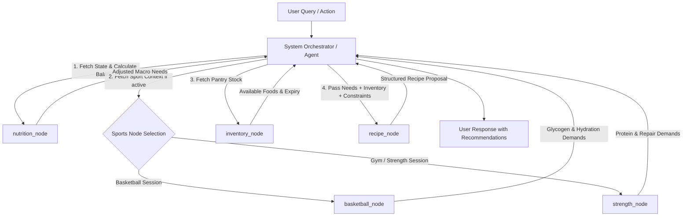
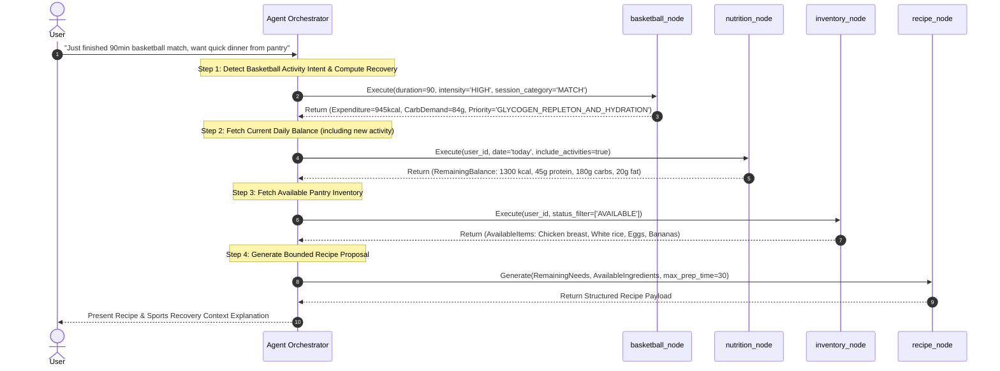

# Modular Node Contracts and Orchestration Specs

## 1. Overview and Architecture Principles

This document specifies the formal input and output contracts between the **Orchestrator** (System Agent) and the individual **Modular Nodes** in the Intelligent Sports Nutrition System.

### Core Architectural Principles

1. **Strict Decoupling**: The Orchestrator does not contain sports domain rules or nutritional calculations. It delegates domain-specific logic to modular nodes and synthesizes their responses.
2. **Deterministic vs. Generative Node Division**:
   - **Deterministic Nodes** (`nutrition_node`, `inventory_node`, `basketball_node`, `strength_node`): Execute pure mathematical equations and database queries. Inputs and outputs are strictly typed JSON payloads with 100% reproducible results.
   - **Generative Nodes** (`recipe_node`): Utilize Large Language Models (LLM) to perform creative synthesis (e.g., culinary meal design). Their execution is tightly bounded by deterministic input constraints provided by prior node steps.
3. **Contract Standardization**: Every node exposes a stateless function signature accepting a standard `JSON` payload and returning a validated `JSON` response containing execution metadata, explicit outputs, and standard error handling fields.

---

## 2. System Orchestrator & Node Pipeline

### Orchestrator Responsibilities

- **Intent Recognition**: Analyzes user natural language queries (e.g., *"I just finished a basketball match, what should I make for dinner with what I have?"*).
- **Node Selection & DAG Resolution**: Determines the required execution Directed Acyclic Graph (DAG) and executes nodes sequentially or in parallel based on data dependencies.
- **Context Synthesis**: Combines deterministic outputs (remaining macro needs, available ingredients, sport recovery guidelines) into structured prompts for generative nodes or final user responses.



---

## 3. Node Contract: `nutrition_node`

### 3.1. Purpose & Responsibilities

Calculates the user's current daily nutritional state by comparing deterministic daily target requirements against logged food consumption and physical activity expenditure for a given date.

### 3.2. Input Contract

#### Input JSON Schema (`nutrition_node_input.json`)

```json
{
  "$schema": "http://json-schema.org/draft-07/schema#",
  "title": "NutritionNodeInput",
  "type": "object",
  "required": ["user_id", "date"],
  "properties": {
    "user_id": {
      "type": "string",
      "format": "uuid",
      "description": "Unique identifier of the target user."
    },
    "date": {
      "type": "string",
      "format": "date",
      "description": "Target date for calculation (YYYY-MM-DD)."
    },
    "include_activities": {
      "type": "boolean",
      "default": true,
      "description": "Whether to dynamically adjust carbohydrate and caloric targets based on logged physical activity."
    }
  },
  "additionalProperties": false
}
```

#### Example Input Payload

```json
{
  "user_id": "9b1deb4d-3b7d-4bad-9bdd-2b0d7b3dcb6d",
  "date": "2026-09-11",
  "include_activities": true
}
```

### 3.3. Output Contract

#### Output JSON Schema (`nutrition_node_output.json`)

```json
{
  "$schema": "http://json-schema.org/draft-07/schema#",
  "title": "NutritionNodeOutput",
  "type": "object",
  "required": [
    "user_id",
    "date",
    "daily_targets",
    "consumed",
    "activity_expenditure",
    "adjusted_targets",
    "remaining_balance",
    "nutritional_status_flag"
  ],
  "properties": {
    "user_id": { "type": "string", "format": "uuid" },
    "date": { "type": "string", "format": "date" },
    "daily_targets": {
      "type": "object",
      "required": ["calories_kcal", "protein_g", "carbohydrates_g", "fat_g"],
      "properties": {
        "calories_kcal": { "type": "number", "minimum": 0 },
        "protein_g": { "type": "number", "minimum": 0 },
        "carbohydrates_g": { "type": "number", "minimum": 0 },
        "fat_g": { "type": "number", "minimum": 0 }
      }
    },
    "consumed": {
      "type": "object",
      "required": ["calories_kcal", "protein_g", "carbohydrates_g", "fat_g", "logged_meals_count"],
      "properties": {
        "calories_kcal": { "type": "number", "minimum": 0 },
        "protein_g": { "type": "number", "minimum": 0 },
        "carbohydrates_g": { "type": "number", "minimum": 0 },
        "fat_g": { "type": "number", "minimum": 0 },
        "logged_meals_count": { "type": "integer", "minimum": 0 }
      }
    },
    "activity_expenditure": {
      "type": "object",
      "required": ["total_expenditure_kcal", "additional_carbs_demand_g", "logged_activities_count"],
      "properties": {
        "total_expenditure_kcal": { "type": "number", "minimum": 0 },
        "additional_carbs_demand_g": { "type": "number", "minimum": 0 },
        "logged_activities_count": { "type": "integer", "minimum": 0 }
      }
    },
    "adjusted_targets": {
      "type": "object",
      "required": ["calories_kcal", "protein_g", "carbohydrates_g", "fat_g"],
      "properties": {
        "calories_kcal": { "type": "number", "minimum": 0 },
        "protein_g": { "type": "number", "minimum": 0 },
        "carbohydrates_g": { "type": "number", "minimum": 0 },
        "fat_g": { "type": "number", "minimum": 0 }
      }
    },
    "remaining_balance": {
      "type": "object",
      "required": ["remaining_calories_kcal", "remaining_protein_g", "remaining_carbs_g", "remaining_fat_g"],
      "properties": {
        "remaining_calories_kcal": { "type": "number" },
        "remaining_protein_g": { "type": "number" },
        "remaining_carbs_g": { "type": "number" },
        "remaining_fat_g": { "type": "number" }
      }
    },
    "nutritional_status_flag": {
      "type": "string",
      "enum": ["SURPLUS", "DEFICIT", "BALANCED", "PROTEIN_DEFICIT", "CARB_DEFICIT"]
    }
  },
  "additionalProperties": false
}
```

#### Example Output Payload

```json
{
  "user_id": "9b1deb4d-3b7d-4bad-9bdd-2b0d7b3dcb6d",
  "date": "2026-09-11",
  "daily_targets": {
    "calories_kcal": 2500.0,
    "protein_g": 160.0,
    "carbohydrates_g": 300.0,
    "fat_g": 70.0
  },
  "consumed": {
    "calories_kcal": 1800.0,
    "protein_g": 115.0,
    "carbohydrates_g": 210.0,
    "fat_g": 50.0,
    "logged_meals_count": 3
  },
  "activity_expenditure": {
    "total_expenditure_kcal": 600.0,
    "additional_carbs_demand_g": 90.0,
    "logged_activities_count": 1
  },
  "adjusted_targets": {
    "calories_kcal": 3100.0,
    "protein_g": 160.0,
    "carbohydrates_g": 390.0,
    "fat_g": 70.0
  },
  "remaining_balance": {
    "remaining_calories_kcal": 1300.0,
    "remaining_protein_g": 45.0,
    "remaining_carbs_g": 180.0,
    "remaining_fat_g": 20.0
  },
  "nutritional_status_flag": "DEFICIT"
}
```

---

## 4. Node Contract: `inventory_node`

### 4.1. Purpose & Responsibilities

Queries, filters, and formats available user pantry stock. Computes macronutrient density tags for each item to optimize ingredient selection for downstream recommendation engines.

### 4.2. Input Contract

#### Input JSON Schema (`inventory_node_input.json`)

```json
{
  "$schema": "http://json-schema.org/draft-07/schema#",
  "title": "InventoryNodeInput",
  "type": "object",
  "required": ["user_id"],
  "properties": {
    "user_id": { "type": "string", "format": "uuid" },
    "status_filter": {
      "type": "array",
      "items": { "type": "string", "enum": ["AVAILABLE", "LOW_STOCK", "EXPIRED", "CONSUMED"] },
      "default": ["AVAILABLE", "LOW_STOCK"]
    },
    "max_expiration_days": {
      "type": "integer",
      "minimum": 0,
      "description": "Optional upper bound to select foods expiring within N days."
    },
    "density_filter": {
      "type": "array",
      "items": { "type": "string", "enum": ["PROTEIN_DENSE", "CARB_DENSE", "FAT_DENSE", "BALANCED"] },
      "description": "Filter inventory items by nutrient density classification."
    },
    "exclude_food_item_ids": {
      "type": "array",
      "items": { "type": "string", "format": "uuid" }
    }
  },
  "additionalProperties": false
}
```

#### Example Input Payload

```json
{
  "user_id": "9b1deb4d-3b7d-4bad-9bdd-2b0d7b3dcb6d",
  "status_filter": ["AVAILABLE"],
  "max_expiration_days": 7,
  "density_filter": ["PROTEIN_DENSE", "CARB_DENSE"]
}
```

### 4.3. Output Contract

#### Output JSON Schema (`inventory_node_output.json`)

```json
{
  "$schema": "http://json-schema.org/draft-07/schema#",
  "title": "InventoryNodeOutput",
  "type": "object",
  "required": ["user_id", "total_items_found", "inventory_items"],
  "properties": {
    "user_id": { "type": "string", "format": "uuid" },
    "total_items_found": { "type": "integer", "minimum": 0 },
    "inventory_items": {
      "type": "array",
      "items": {
        "type": "object",
        "required": [
          "inventory_item_id",
          "food_item_id",
          "name",
          "category",
          "available_quantity",
          "unit",
          "status",
          "density_class",
          "nutrition_per_serving"
        ],
        "properties": {
          "inventory_item_id": { "type": "string", "format": "uuid" },
          "food_item_id": { "type": "string", "format": "uuid" },
          "name": { "type": "string" },
          "category": { "type": "string" },
          "available_quantity": { "type": "number", "minimum": 0 },
          "unit": { "type": "string" },
          "expiration_date": { "type": ["string", "null"], "format": "date" },
          "days_until_expiration": { "type": ["integer", "null"] },
          "status": { "type": "string" },
          "density_class": { "type": "string", "enum": ["PROTEIN_DENSE", "CARB_DENSE", "FAT_DENSE", "BALANCED"] },
          "nutrition_per_serving": {
            "type": "object",
            "required": ["serving_size", "serving_unit", "calories_kcal", "protein_g", "carbohydrates_g", "fat_g"],
            "properties": {
              "serving_size": { "type": "number" },
              "serving_unit": { "type": "string" },
              "calories_kcal": { "type": "number" },
              "protein_g": { "type": "number" },
              "carbohydrates_g": { "type": "number" },
              "fat_g": { "type": "number" }
            }
          }
        }
      }
    }
  },
  "additionalProperties": false
}
```

#### Example Output Payload

```json
{
  "user_id": "9b1deb4d-3b7d-4bad-9bdd-2b0d7b3dcb6d",
  "total_items_found": 3,
  "inventory_items": [
    {
      "inventory_item_id": "8f3e2d1c-0b9a-8f7e-6d5c-4b3a2f1e0d9c",
      "food_item_id": "c1a2b3c4-d5e6-7f8a-9b0c-1d2e3f4a5b6c",
      "name": "Chicken breast",
      "category": "Poultry",
      "available_quantity": 400.0,
      "unit": "g",
      "expiration_date": "2026-09-13",
      "days_until_expiration": 2,
      "status": "AVAILABLE",
      "density_class": "PROTEIN_DENSE",
      "nutrition_per_serving": {
        "serving_size": 100.0,
        "serving_unit": "g",
        "calories_kcal": 165.0,
        "protein_g": 31.0,
        "carbohydrates_g": 0.0,
        "fat_g": 3.6
      }
    },
    {
      "inventory_item_id": "7a6b5c4d-3e2f-1a0b-9c8d-7e6f5a4b3c2d",
      "food_item_id": "e5f6a7b8-c9d0-1e2f-3a4b-5c6d7e8f9a0b",
      "name": "White rice",
      "category": "Grains",
      "available_quantity": 1000.0,
      "unit": "g",
      "expiration_date": null,
      "days_until_expiration": null,
      "status": "AVAILABLE",
      "density_class": "CARB_DENSE",
      "nutrition_per_serving": {
        "serving_size": 100.0,
        "serving_unit": "g",
        "calories_kcal": 130.0,
        "protein_g": 2.7,
        "carbohydrates_g": 28.0,
        "fat_g": 0.3
      }
    }
  ]
}
```

---

## 5. Sports Node Contracts

Sports nodes process activity parameters to compute accurate MET-based energy expenditure and specialized post-exercise recovery needs.

### 5.1. `basketball_node`

#### Purpose & Responsibilities
Calculates energy expenditure for basketball matches and training sessions, alongside specific carbohydrate resynthesis and fluid recovery targets.

#### Input Contract (`basketball_node_input.json`)

```json
{
  "$schema": "http://json-schema.org/draft-07/schema#",
  "title": "BasketballNodeInput",
  "type": "object",
  "required": ["user_id", "duration_minutes", "intensity", "session_category", "user_weight_kg"],
  "properties": {
    "user_id": { "type": "string", "format": "uuid" },
    "duration_minutes": { "type": "integer", "minimum": 1 },
    "intensity": { "type": "string", "enum": ["LOW", "MEDIUM", "HIGH", "VERY_HIGH"] },
    "session_category": { "type": "string", "enum": ["TRAINING", "MATCH"] },
    "user_weight_kg": { "type": "number", "minimum": 20 }
  },
  "additionalProperties": false
}
```

#### Output Contract (`basketball_node_output.json`)

```json
{
  "$schema": "http://json-schema.org/draft-07/schema#",
  "title": "BasketballNodeOutput",
  "type": "object",
  "required": [
    "sport",
    "session_category",
    "duration_minutes",
    "intensity",
    "estimated_expenditure_kcal",
    "met_value_used",
    "carb_demand_g",
    "hydration_demand_ml",
    "recovery_priority"
  ],
  "properties": {
    "sport": { "type": "string", "const": "BASKETBALL" },
    "session_category": { "type": "string", "enum": ["TRAINING", "MATCH"] },
    "duration_minutes": { "type": "integer" },
    "intensity": { "type": "string" },
    "estimated_expenditure_kcal": { "type": "number", "minimum": 0 },
    "met_value_used": { "type": "number", "minimum": 0 },
    "carb_demand_g": { "type": "number", "minimum": 0 },
    "hydration_demand_ml": { "type": "number", "minimum": 0 },
    "recovery_priority": { "type": "string", "const": "GLYCOGEN_REPLETON_AND_HYDRATION" }
  },
  "additionalProperties": false
}
```

#### Example Basketball Output Payload

```json
{
  "sport": "BASKETBALL",
  "session_category": "MATCH",
  "duration_minutes": 90,
  "intensity": "HIGH",
  "estimated_expenditure_kcal": 945.0,
  "met_value_used": 9.0,
  "carb_demand_g": 84.0,
  "hydration_demand_ml": 1125.0,
  "recovery_priority": "GLYCOGEN_REPLETON_AND_HYDRATION"
}
```

---

### 5.2. `strength_node` (Gym / Hypertrophy)

#### Purpose & Responsibilities
Calculates energy expenditure for gym strength/hypertrophy workouts and determines acute Muscle Protein Synthesis (MPS) amino acid recovery demands.

#### Input Contract (`strength_node_input.json`)

```json
{
  "$schema": "http://json-schema.org/draft-07/schema#",
  "title": "StrengthNodeInput",
  "type": "object",
  "required": ["user_id", "duration_minutes", "intensity", "training_type", "user_weight_kg"],
  "properties": {
    "user_id": { "type": "string", "format": "uuid" },
    "duration_minutes": { "type": "integer", "minimum": 1 },
    "intensity": { "type": "string", "enum": ["LOW", "MEDIUM", "HIGH", "VERY_HIGH"] },
    "training_type": { "type": "string", "enum": ["HYPERTROPHY", "STRENGTH", "POWER", "HYBRID", "ENDURANCE"] },
    "user_weight_kg": { "type": "number", "minimum": 20 },
    "targeted_muscle_groups": {
      "type": "array",
      "items": { "type": "string" }
    },
    "total_volume_kg": { "type": "number", "minimum": 0 }
  },
  "additionalProperties": false
}
```

#### Output Contract (`strength_node_output.json`)

```json
{
  "$schema": "http://json-schema.org/draft-07/schema#",
  "title": "StrengthNodeOutput",
  "type": "object",
  "required": [
    "sport",
    "training_type",
    "duration_minutes",
    "intensity",
    "estimated_expenditure_kcal",
    "met_value_used",
    "protein_demand_g",
    "carb_demand_g",
    "recovery_priority"
  ],
  "properties": {
    "sport": { "type": "string", "const": "STRENGTH_TRAINING" },
    "training_type": { "type": "string" },
    "duration_minutes": { "type": "integer" },
    "intensity": { "type": "string" },
    "estimated_expenditure_kcal": { "type": "number", "minimum": 0 },
    "met_value_used": { "type": "number" },
    "protein_demand_g": { "type": "number", "minimum": 0 },
    "carb_demand_g": { "type": "number", "minimum": 0 },
    "recovery_priority": { "type": "string", "const": "MUSCLE_PROTEIN_SYNTHESIS_AND_REPAIR" },
    "targeted_muscle_groups": { "type": "array", "items": { "type": "string" } }
  },
  "additionalProperties": false
}
```

#### Example Strength Output Payload

```json
{
  "sport": "STRENGTH_TRAINING",
  "training_type": "HYPERTROPHY",
  "duration_minutes": 75,
  "intensity": "HIGH",
  "estimated_expenditure_kcal": 437.5,
  "met_value_used": 7.0,
  "protein_demand_g": 30.0,
  "carb_demand_g": 42.0,
  "recovery_priority": "MUSCLE_PROTEIN_SYNTHESIS_AND_REPAIR",
  "targeted_muscle_groups": ["CHEST", "TRICEPS"]
}
```

---

## 6. Node Contract: `recipe_node`

### 6.1. Purpose & Responsibilities

Generative node that takes structured target macronutrients, available pantry ingredients, and meal constraints to generate a culinary recipe tailored to remaining needs.

### 6.2. Input Contract

#### Input JSON Schema (`recipe_node_input.json`)

```json
{
  "$schema": "http://json-schema.org/draft-07/schema#",
  "title": "RecipeNodeInput",
  "type": "object",
  "required": ["remaining_needs", "available_ingredients"],
  "properties": {
    "remaining_needs": {
      "type": "object",
      "required": ["remaining_calories_kcal", "remaining_protein_g", "remaining_carbs_g", "remaining_fat_g"],
      "properties": {
        "remaining_calories_kcal": { "type": "number" },
        "remaining_protein_g": { "type": "number" },
        "remaining_carbs_g": { "type": "number" },
        "remaining_fat_g": { "type": "number" }
      }
    },
    "available_ingredients": {
      "type": "array",
      "items": {
        "type": "object",
        "required": ["food_item_id", "name", "available_quantity", "unit", "density_class"],
        "properties": {
          "food_item_id": { "type": "string", "format": "uuid" },
          "name": { "type": "string" },
          "available_quantity": { "type": "number" },
          "unit": { "type": "string" },
          "density_class": { "type": "string" },
          "expiration_date": { "type": ["string", "null"] }
        }
      }
    },
    "user_constraints": {
      "type": "object",
      "properties": {
        "max_preparation_time_minutes": { "type": "integer", "default": 30 },
        "meal_type": { "type": "string", "enum": ["BREAKFAST", "LUNCH", "DINNER", "SNACK", "POST_WORKOUT"] },
        "dietary_restrictions": { "type": "array", "items": { "type": "string" } },
        "disliked_ingredients": { "type": "array", "items": { "type": "string" } }
      }
    },
    "sports_recovery_context": {
      "type": "object",
      "properties": {
        "sport": { "type": "string" },
        "recovery_priority": { "type": "string" }
      }
    }
  },
  "additionalProperties": false
}
```

### 6.3. Output Contract

#### Output JSON Schema (`recipe_node_output.json`)

```json
{
  "$schema": "http://json-schema.org/draft-07/schema#",
  "title": "RecipeNodeOutput",
  "type": "object",
  "required": [
    "recipe_name",
    "prep_time_minutes",
    "cook_time_minutes",
    "total_time_minutes",
    "servings",
    "ingredients_used",
    "preparation_steps",
    "estimated_nutritional_summary",
    "explanation"
  ],
  "properties": {
    "recipe_name": { "type": "string" },
    "prep_time_minutes": { "type": "integer", "minimum": 0 },
    "cook_time_minutes": { "type": "integer", "minimum": 0 },
    "total_time_minutes": { "type": "integer", "minimum": 0 },
    "servings": { "type": "integer", "minimum": 1 },
    "ingredients_used": {
      "type": "array",
      "items": {
        "type": "object",
        "required": ["food_item_id", "name", "quantity_used", "unit", "is_from_inventory"],
        "properties": {
          "food_item_id": { "type": ["string", "null"], "format": "uuid" },
          "name": { "type": "string" },
          "quantity_used": { "type": "number", "minimum": 0 },
          "unit": { "type": "string" },
          "is_from_inventory": { "type": "boolean" }
        }
      }
    },
    "preparation_steps": {
      "type": "array",
      "items": {
        "type": "object",
        "required": ["step_number", "instruction"],
        "properties": {
          "step_number": { "type": "integer" },
          "instruction": { "type": "string" }
        }
      }
    },
    "estimated_nutritional_summary": {
      "type": "object",
      "required": ["calories_kcal", "protein_g", "carbohydrates_g", "fat_g"],
      "properties": {
        "calories_kcal": { "type": "number" },
        "protein_g": { "type": "number" },
        "carbohydrates_g": { "type": "number" },
        "fat_g": { "type": "number" }
      }
    },
    "nutritional_fit_score": { "type": "number", "minimum": 0, "maximum": 100 },
    "explanation": { "type": "string" }
  },
  "additionalProperties": false
}
```

#### Example Recipe Output Payload

```json
{
  "recipe_name": "Post-Match Chicken & Rice Bowl",
  "prep_time_minutes": 10,
  "cook_time_minutes": 15,
  "total_time_minutes": 25,
  "servings": 1,
  "ingredients_used": [
    {
      "food_item_id": "c1a2b3c4-d5e6-7f8a-9b0c-1d2e3f4a5b6c",
      "name": "Chicken breast",
      "quantity_used": 150.0,
      "unit": "g",
      "is_from_inventory": true
    },
    {
      "food_item_id": "e5f6a7b8-c9d0-1e2f-3a4b-5c6d7e8f9a0b",
      "name": "White rice",
      "quantity_used": 200.0,
      "unit": "g",
      "is_from_inventory": true
    }
  ],
  "preparation_steps": [
    {
      "step_number": 1,
      "instruction": "Cook 200g white rice according to package instructions."
    },
    {
      "step_number": 2,
      "instruction": "Dice chicken breast, season with salt and pepper, and pan-fry on medium heat for 8-10 minutes until fully cooked."
    },
    {
      "step_number": 3,
      "instruction": "Combine chicken and rice in a bowl and serve immediately."
    }
  ],
  "estimated_nutritional_summary": {
    "calories_kcal": 507.5,
    "protein_g": 51.9,
    "carbohydrates_g": 56.0,
    "fat_g": 6.0
  },
  "nutritional_fit_score": 92.5,
  "explanation": "This meal provides 51.9g of high-quality protein to support muscle repair and 56g of fast-digesting carbohydrates to restore depleted glycogen after your basketball match."
}
```

---

## 7. Multi-Node Pipeline Workflows

### 7.1. Complex Query: Post-Workout Meal Recommendation Workflow

User query: *"I just finished a 90-minute intense basketball match and I want to cook dinner in under 30 minutes with what I have in my pantry."*



---

## 8. Error Handling, Edge Cases, and Invariants

### 8.1. Edge Cases & Fallback Protocols

1. **Empty Inventory (`total_items_found = 0`)**:
   - `inventory_node` returns an empty array.
   - `recipe_node` sets `is_from_inventory = false` for suggested ingredients and explicitly flags the output payload: `"warning": "Pantry empty. Recommendation based on standard store ingredients."`
2. **Exceeded Caloric Target (`remaining_calories_kcal < 0`)**:
   - `nutrition_node` sets `nutritional_status_flag = "SURPLUS"`.
   - `recipe_node` prioritizes low-calorie, high-protein/fiber options or suggests light snacks instead of heavy meals.
3. **Missing Sport Specialization Data**:
   - If an activity has no sport-specific extension record, the Orchestrator falls back to core `Activity.estimated_expenditure_kcal` and applies baseline recovery demands (0.25g/kg protein, 0.5g/kg carbs).

### 8.2. Contract Invariants

- **Deterministic Isolation**: No generative LLM call may modify target macronutrients or inventory quantities.
- **Portion Bound Validity**: `recipe_node` cannot consume greater quantities of an inventory item than what is reported in `available_quantity` by `inventory_node`.
- **JSON Schema Strictness**: All node responses MUST pass JSON schema validation before being processed by subsequent pipeline nodes.
