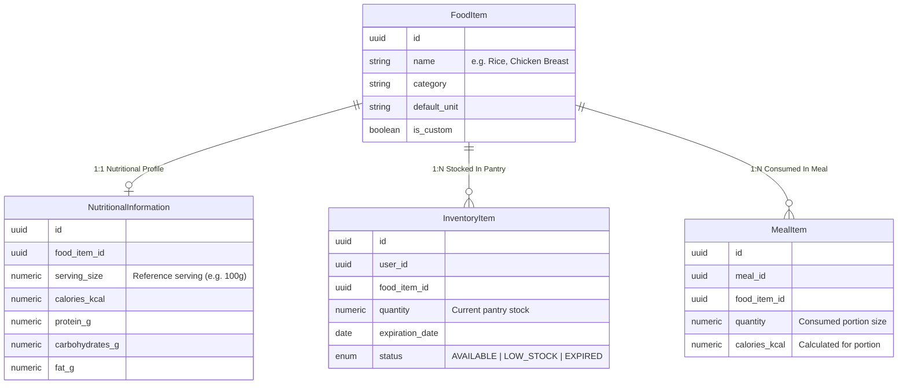

# ADR-004: Domain Naming Conventions & Entity Modeling (`FoodItem` vs. `InventoryItem` vs. `NutritionalInformation`)

## Status

**ACCEPTED**

## Date

2026-09-11

## Context & Problem Statement

In early domain modeling discussions, food-related concepts were ambiguously named (e.g., using generic terms like `Food` or mixing food dictionary definitions with physical pantry stock). 

A generic `Food` entity creates severe domain confusion:
- Is a `Food` an entry in a global nutritional database (e.g., "Raw Chicken Breast")?
- Is a `Food` a physical item sitting in a user's pantry with an expiration date (e.g., "400g Chicken Breast expiring in 2 days")?
- Is a `Food` a portion of an item consumed within a logged meal (e.g., "150g cooked Chicken Breast eaten at lunch")?

To ensure clarity across database tables, code models, API payloads, and LLM node contracts, formal domain naming conventions and entity separation boundaries must be established.

## Decision Drivers

- **Domain-Driven Design (DDD) Clarity**: Distinct domain concepts must have distinct, unambiguous class and table names.
- **Normalisation & Reusability**: Nutritional composition (macros/micros per serving) must be defined once per catalog item rather than duplicated across every pantry stock item or logged meal portion.
- **Code & API Uniformity**: Developer team and LLM prompts must use standardized, immutable entity nomenclature.

## Considered Options

1. **Single Generic `Food` Entity**: Use a single entity named `Food` containing catalog info, macros, stock quantities, and expiration dates.
2. **Embedded JSON Nutritional Data in Inventory**: Store macros directly inside `InventoryItem` as JSON without a normalized catalog entity.
3. **Normalized DDD Entity Hierarchy (`FoodItem`, `NutritionalInformation`, `InventoryItem`, `MealItem`)**: Explicitly separate global catalog definitions (`FoodItem`), 1:1 macro values (`NutritionalInformation`), user pantry stock (`InventoryItem`), and consumed meal portions (`MealItem`).

## Decision Outcome

**Option 3: Normalized DDD Entity Hierarchy (`FoodItem`, `NutritionalInformation`, `InventoryItem`, `MealItem`)**.

### Standardized Naming Conventions

1. **`FoodItem`** (Global Food Catalog Dictionary):
   - Represents the general food catalog entry (e.g., "White Rice", "Chicken Breast", "Olive Oil").
   - Contains general taxonomy metadata (`name`, `category`, `default_unit`, `is_custom`, `created_by_user_id`).
   - Does **NOT** contain physical stock quantities, expiration dates, or portion measurements.

2. **`NutritionalInformation`** (Macro/Micro Composition):
   - 1:1 entity linked to `FoodItem` defining nutritional values per standard reference serving (e.g., per 100g, 100ml, or 1 unit).
   - Contains `calories_kcal`, `protein_g`, `carbohydrates_g`, `fat_g`, `fiber_g`, `sugars_g`, `sodium_mg`.

3. **`InventoryItem`** (User Pantry Stock):
   - 1:N entity linking a `User` to a `FoodItem`.
   - Represents physical food owned by a user, tracking `quantity`, `unit`, `expiration_date`, and `status`.

4. **`Meal` & `MealItem`** (Intake Logs):
   - `Meal` represents a logged eating event (`meal_type`, `logged_at`, aggregated macros).
   - `MealItem` represents a specific portion of a `FoodItem` consumed during that meal, storing portion-calculated macros.

## Consequences

### Positive
- Zero domain ambiguity across code modules (`core/food/`, `core/inventory/`, `core/meals/`).
- Standardized terminology across database migrations, Python domain models, TypeScript frontend types, and LLM node prompt specifications.
- Clean database normalization: Updating a food's global nutritional info does not require modifying pantry inventory records.

### Negative
- Developers must strictly use `FoodItem` (not generic `Food`) in all code, comments, and schemas.
