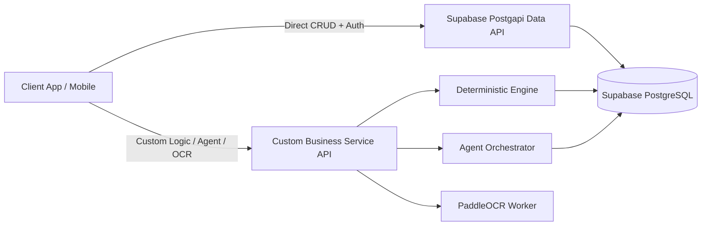

# api API Specification

## 1. Architectural Overview & API Strategy

The Intelligent Sports Nutrition System utilizes a **Hybrid API Model** combining Supabase's managed infrastructure with custom backend service endpoints:

1. **Direct Database Data API (Supabase Postgapi)**: Standard Create, Read, Update, Delete (CRUD) operations on relational entities (`FoodItem`, `InventoryItem`, `Meal`, `Activity`) are accessed directly via Supabase auto-generated Postgapi endpoints and the `@supabase/supabase-js` client SDK.
2. **Custom Business Logic & Engine Endpoints**: Complex deterministic calculations (BMR/TDEE math, MET expenditure, sports recovery demands, remaining macro balances), multimodal receipt OCR processing, and LLM agent orchestration are exposed via custom api API endpoints (FastAPI / Supabase Edge Functions).



---

## 2. Global Headers & Authentication

All API requests require standard authentication headers managed via Supabase Auth.

### Headers

| Header Name | Value / Format | Required | Description |
|---|---|---|---|
| `Authorization` | `Bearer <JWT_TOKEN>` | Yes | Supabase authenticated user JWT token |
| `apikey` | `<SUPABASE_ANON_KEY>` | Yes | Public Supabase client key |
| `Content-Type` | `application/json` | Yes (for POST/PUT) | Payload mime type |

### Standard Error Response Payload

```json
{
  "error": {
    "code": "INVALID_INPUT_PARAMETER",
    "message": "Field 'duration_minutes' must be a positive integer greater than 0.",
    "status_code": 400,
    "timestamp": "2026-09-11T14:50:00Z"
  }
}
```

---

## 3. Direct Database Data API (Supabase Postgapi)

Supabase automatically exposes api endpoints over PostgreSQL tables. Row Level Security (RLS) policies enforce user-level data isolation (`auth.uid() = user_id`).

### 3.1. `FoodItem` Dictionary Catalog

- `GET /api/v1/food_items?select=*,nutritional_information(*)`
  - Query food catalog with associated 1:1 nutritional composition.
  - Query parameters: `name=ilike.*chicken*`, `category=eq.Poultry`, `limit=20`.
- `POST /api/v1/food_items`
  - Create a custom user-defined food catalog item.

### 3.2. `InventoryItem` Pantry Stock

- `GET /api/v1/inventory_items?select=*,food_item:food_items(*)`
  - Fetch user's pantry inventory.
  - Query parameters: `status=eq.AVAILABLE`, `order=expiration_date.asc.nullslast`.
- `POST /api/v1/inventory_items`
  - Insert new item into pantry.
- `PATCH /api/v1/inventory_items?id=eq.{uuid}`
  - Update quantity or status of an existing pantry item.
- `DELETE /api/v1/inventory_items?id=eq.{uuid}`
  - Remove item from pantry.

### 3.3. `Meal` Intake Logs

- `GET /api/v1/meals?select=*,meal_items(*,food_item:food_items(*))`
  - Fetch user logged meals.
  - Query parameters: `logged_at=gte.2026-09-11T00:00:00Z`, `order=logged_at.desc`.
- `POST /api/v1/meals`
  - Log a meal record.

---

## 4. Custom Business & Engine Endpoints

These custom endpoints execute server-side business logic, deterministic calculations, and agent workflows.

### 4.1. `POST /api/v1/nutrition/calculate_targets`

Recalculates daily caloric and macronutrient targets deterministically based on user physical attributes and goals.

#### Request Payload

```json
{
  "weight_kg": 78.5,
  "height_cm": 182.0,
  "age": 25,
  "activity_level": "ACTIVE",
  "body_composition_goal": "BULK",
  "nutritional_goal": "PERFORMANCE"
}
```

#### Response Payload (`200 OK`)

```json
{
  "user_id": "9b1deb4d-3b7d-4bad-9bdd-2b0d7b3dcb6d",
  "calculated_targets": {
    "bmr_kcal": 1805.0,
    "tdee_kcal": 3113.6,
    "daily_calories_target": 3487.2,
    "daily_protein_g_target": 141.3,
    "daily_fat_g_target": 96.9,
    "daily_carbs_g_target": 512.5
  },
  "updated_at": "2026-09-11T14:50:00Z"
}
```

---

### 4.2. `GET /api/v1/nutrition/daily_summary`

Returns a complete deterministic snapshot of daily targets, consumed intake, activity expenditures, and remaining macronutrient balance.

#### Query Parameters
- `date` (string, required): Format `YYYY-MM-DD`.

#### Response Payload (`200 OK`)

```json
{
  "user_id": "9b1deb4d-3b7d-4bad-9bdd-2b0d7b3dcb6d",
  "date": "2026-09-11",
  "summary": {
    "targets": {
      "calories_kcal": 2500.0,
      "protein_g": 160.0,
      "carbs_g": 300.0,
      "fat_g": 70.0
    },
    "consumed": {
      "calories_kcal": 1800.0,
      "protein_g": 115.0,
      "carbs_g": 210.0,
      "fat_g": 50.0
    },
    "activity_expenditure_kcal": 600.0,
    "adjusted_targets": {
      "calories_kcal": 3100.0,
      "carbs_g": 390.0
    },
    "remaining_balance": {
      "remaining_calories_kcal": 1300.0,
      "remaining_protein_g": 45.0,
      "remaining_carbs_g": 180.0,
      "remaining_fat_g": 20.0
    },
    "status_flag": "DEFICIT"
  }
}
```

---

### 4.3. `POST /api/v1/activities/log`

Logs a physical exercise session, calculates MET energy expenditure deterministically, and triggers sport recovery demands.

#### Request Payload (Basketball Example)

```json
{
  "sport": "BASKETBALL",
  "session_type": "Competitive Match",
  "duration_minutes": 90,
  "intensity": "HIGH",
  "date": "2026-09-11T18:00:00Z",
  "basketball_details": {
    "session_category": "MATCH"
  }
}
```

#### Response Payload (`201 Created`)

```json
{
  "activity_id": "3a4b5c6d-7e8f-9a0b-1c2d-3e4f5a6b7c8d",
  "sport": "BASKETBALL",
  "duration_minutes": 90,
  "estimated_expenditure_kcal": 945.0,
  "recovery_demands": {
    "carb_demand_g": 84.0,
    "hydration_demand_ml": 1125.0,
    "recovery_priority": "GLYCOGEN_REPLETON_AND_HYDRATION"
  }
}
```

---

### 4.4. `POST /api/v1/agent/query`

Executes a natural language query through the Agent Orchestrator. The orchestrator invokes required deterministic nodes (`nutrition_node`, `inventory_node`, sports nodes) and delegates culinary synthesis to `recipe_node`.

#### Request Payload

```json
{
  "query": "I just finished my basketball match, what can I cook for dinner with what I have in my pantry?",
  "constraints": {
    "max_preparation_time_minutes": 25,
    "meal_type": "DINNER"
  }
}
```

#### Response Payload (`200 OK`)

```json
{
  "query_id": "f1e2d3c4-b5a6-9f8e-7d6c-5b4a3f2e1d0c",
  "orchestrator_pipeline": ["basketball_node", "nutrition_node", "inventory_node", "recipe_node"],
  "response": {
    "text_summary": "After your basketball match today, you need 51.9g of protein and 56g of carbs for optimal glycogen replenishment. Based on your pantry, here is a quick 25-minute recipe:",
    "recipe": {
      "recipe_name": "Post-Match Chicken & Rice Bowl",
      "prep_time_minutes": 10,
      "cook_time_minutes": 15,
      "ingredients_used": [
        { "name": "Chicken breast", "quantity_used": 150.0, "unit": "g", "is_from_inventory": true },
        { "name": "White rice", "quantity_used": 200.0, "unit": "g", "is_from_inventory": true }
      ],
      "estimated_nutritional_summary": {
        "calories_kcal": 507.5,
        "protein_g": 51.9,
        "carbohydrates_g": 56.0,
        "fat_g": 6.0
      },
      "nutritional_fit_score": 92.5
    }
  }
}
```

---

### 4.5. `POST /api/v1/inventory/ocr`

Uploads a supermarket purchase receipt image for OCR text extraction (PaddleOCR) and LLM product JSON parsing. Returns candidate draft items for user review.

#### Request Format
`multipart/form-data` with file field `receipt_image`.

#### Response Payload (`200 OK`)

```json
{
  "ocr_session_id": "d9e8f7a6-b5c4-3d2e-1f0a-9b8c7d6e5f4a",
  "extracted_products": [
    {
      "candidate_name": "Chicken breast",
      "quantity": 400.0,
      "unit": "g",
      "matched_food_item": {
        "food_item_id": "c1a2b3c4-d5e6-7f8a-9b0c-1d2e3f4a5b6c",
        "name": "Chicken breast",
        "confidence": 0.98
      }
    },
    {
      "candidate_name": "White rice",
      "quantity": 1000.0,
      "unit": "g",
      "matched_food_item": {
        "food_item_id": "e5f6a7b8-c9d0-1e2f-3a4b-5c6d7e8f9a0b",
        "name": "White rice",
        "confidence": 0.95
      }
    }
  ],
  "requires_user_confirmation": true
}
```

---

## 5. Summary Table of Endpoints

| Method | Endpoint Path | Service Layer | Purpose |
|---|---|---|---|
| `GET` | `/api/v1/food_items` | Supabase Postgapi | Search global food catalog |
| `POST` | `/api/v1/food_items` | Supabase Postgapi | Create custom food catalog item |
| `GET` | `/api/v1/inventory_items` | Supabase Postgapi | Query active user pantry stock |
| `POST` | `/api/v1/inventory_items` | Supabase Postgapi | Add item to pantry inventory |
| `POST` | `/api/v1/meals` | Supabase Postgapi | Log consumed meal |
| `POST` | `/api/v1/nutrition/calculate_targets` | Custom Engine | Compute BMR/TDEE & daily macro goals |
| `GET` | `/api/v1/nutrition/daily_summary` | Custom Engine | Fetch daily snapshot & remaining macros |
| `POST` | `/api/v1/activities/log` | Custom Engine | Log activity & calculate MET energy + recovery |
| `POST` | `/api/v1/agent/query` | Agent Orchestrator | Natural language query & recipe recommendation |
| `POST` | `/api/v1/inventory/ocr` | OCR Worker | Parse receipt image into candidate inventory items |
